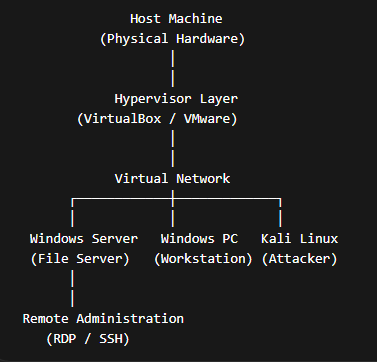

# Project hydra 1.0
IT Home Lab & Portfolio 💻
Hello! I'm an aspiring cybersecurity professional building my skills through hands-on projects. This portfolio documents my journey from a collection of broken computers to a fully functional home lab, demonstrating my ability to diagnose, repair, and deploy IT solutions.

Project Overview
This project began with a challenge: to take five non-functional computers—one desktop and four laptops—and bring them back to life. Through a systematic approach, I’ve successfully diagnosed hardware failures, installed new components, and configured different operating systems to serve specific purposes for a help desk and cybersecurity environment.

My Home Lab Specs
Desktop: Diagnosed with a need for a new SSD and DDR3/DDR3L RAM.
HP Pavilion Laptop: Upgraded with a new SSD and RAM to become a dedicated ethical hacking machine.
Toshiba Satellite Laptop: Upgraded with a new SSD and configured as an Ubuntu file server.
Other Laptops: Two additional laptops, one diagnosed with a hard drive replacement and one with a CPU failure.
Samsung Galaxy Tab A9+: A mobile device being used for a hardware repair project (screen replacement).

Skills Demonstrated
Hardware Troubleshooting & Diagnostics: Used tools like SystemRescue to identify and confirm hardware failures.
Operating System Installation: Experience with installing and configuring various operating systems, including Kali Linux and Ubuntu Server.
Linux Administration: Proficient in using the command line to manage a Linux server, including package installation (apt), file sharing (Samba), and remote management (SSH).
Cybersecurity Fundamentals: Hands-on experience with ethical hacking principles, network scanning (Nmap), and secure configurations.
IT Operations: Practiced with ticketing and asset management concepts using a self-hosted platform.

Project Walkthroughs
Phase 1: Hardware Diagnosis & Troubleshooting
This walkthrough details the initial diagnosis process for each of my computers and the solutions I implemented.

## Lab Architecture

Project Hydra simulates a small enterprise IT environment built through multiple implementation phases. The lab environment includes a host system running a virtualised network with multiple machines used for administration, network services, and security testing.

The architecture allows simulation of real-world enterprise workflows including system administration, remote management, network segmentation, and security monitoring.

### High-Level Architecture

The architecture consists of a host system running a hypervisor which supports multiple virtual machines connected through a segmented virtual network.

Key components include:

• Host machine providing compute resources  
• Hypervisor managing virtual machines  
• Windows server providing file and administrative services  
• Windows workstation acting as a user endpoint  
• Kali Linux attacker system used for security testing  
• Network segmentation enabling controlled attack simulation  

This environment enables practical experimentation with system administration, troubleshooting, security testing, and monitoring workflows.

My Profiles
GitHub: https://github.com/suavesigley
LinkedIn: www.linkedin.com/in/joshuasigley-cybersec0
TryHackMe: https://tryhackme.com/p/suavesigley

Certifications:
Security Engineer Learning Path | TryHackMe | 2024
Introduction to Cyber Security Learning Path | TryHackMe | 2023
Pre-security Learning Path | TryHackMe | 2023
Introduction to Cybersecurity Job Simulation | Commonwealth Bank (via Forage) | 2025
Data Analytics Job Simulation | Deloitte (via Forage) | 2025
Cybersecurity Management Job Simulation | ANZ (via Forage) | 2025
Professional Networking | LinkedIn Learning | 2025

